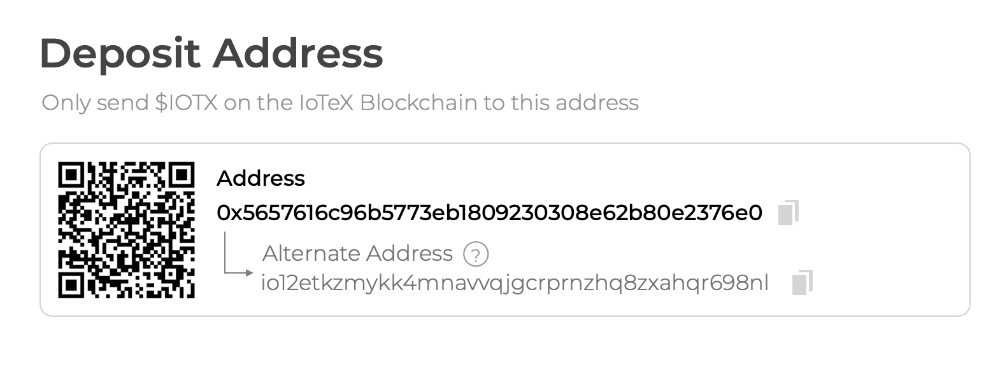

# ioID Step by Step Tutorial

This tutorial demonstrates how to integrate **ioID** into your DePIN project and is divided into two parts:

1\. **Project Registration** on the IoTeX blockchain, explained in this page.

2\. **Device Registration**, which varies based on the scenario and may involve integrating **ioID** either directly on the device or in the project's cloud. Both cases are described in the next pages.


**IoID Web Tools**

IoID Web Tools are designed to streamline experimentation and development for integrating **IoID** into DePIN projects. These tools, currently under development by the IoTeX Foundation, aim to provide a seamless and interactive user experience for creating and managing IoID-based projects.&#x20;

While this page explains how to register your project in IoID using the `ioctl` command line, you can achieve the same using the [IoID Web Tools](https://hub.iotex.io/dev/ioid) where you can list, and manage all your projects interactively, including deploying a default Device NFT contract.


<details>

<summary>Prerequisites</summary>

Before you begin working with the IoTeX blockchain and related tools, follow these preliminary steps to set up your development environment.

### Tools

Ensure you have the following tools installed:

* [ioctl](https://docs.iotex.io/builders/reference-docs/ioctl-client#install-latest-release-build): For interacting with the IoTeX blockchain.
* [curl](https://curl.se/): For sending messages to the API node.
* [jq](https://jqlang.github.io/jq/): Optional, to format JSON output.

### Create and fund a Developer wallet

Start by creating an IoTeX developer wallet and funding it with test tokens.

```bash
ioctl account createadd devaccount
```

Note the `0x` wallet address provided.&#x20;

Set ioctl on the IoTeX testnet:

```bash
ioctl config set endpoint api.testnet.iotex.one:443
```

### **Claim test IOTX**

You can claim test IOTX tokens on the IoTeX Developer portal at [https://developers.iotex.io/faucet](https://developers.iotex.io/faucet).

**Configure Metamask**: if you need to configure Metamask with IoTeX for convenience, you can do so on the&#x20;

Check the balance of your wallet with:

```bash
ioctl account balance devaccount
```

If needed, export the private key with:

```
ioctl account export devaccount
```

</details>

## 1. Register your DePIN Project on IoTeX

In this step, you will register your project on the IoTeX blockchain. This process generates a unique Project ID, which serves as an on-chain identifier for your project, enabling the verification of devices associated with it.


Use a dedicated wallet account as the owner of your on-chain project profile. Whenever possible, consider using a hardware wallet for enhanced security on mainnet.


### Create and fund the Project Owner account

Ensure your ioctl is up to date with

```
ioctl update
```

Start by creating an IoTeX wallet and funding it with test tokens.

<pre class="language-bash"><code class="lang-bash"><strong>ioctl account createadd projectaccount
</strong></code></pre>

Note the `0x` wallet address provided. You can claim test IOTX tokens on the Developer portal at [https://developers.iotex.io/faucet](https://developers.iotex.io/faucet) or ask on our [developers channel on Discord](https://discord.gg/iotex).&#x20;

Let's export the private key:

```bash
ioctl account export devaccount
# Copy the exported private key and export it to the system environment
export PRIVATE_KEY=0x...
```

Let's also make this the default account on ioctl so that we don't need to indicate it as the signer in every command:

```bash
ioctl config set defaultacc projectaccount
```

### Register your project on IoTeX

```bash
ioctl ioid register "MY_DEPIN_PROJECT_NAME"
```

Take note of your `Project ID` and set it as an environment variable:

```bash
export PROJECT_ID=YOUR_PROJECT_ID
```

Reserve a few ioID for your project (10 in the example command below):

```
ioctl ioid apply -p $PROJECT_ID -a 10
```

### Clone the ioID contracts repository

To begin, clone the ioID contracts repository from GitHub. This repository contains the ioID smart contract code you will interact with, as well as related resources, including example contracts:

```bash
git clone https://github.com/iotexproject/ioID-contracts && cd ioID-contracts

npm install
```

### Deploy and link the Device NFT Contract

To finalize the integration with ioID on the blockchain side, your project must include an ERC721 NFT contract. This contract can be fully custom and allows you to pre-register devices on-chain, providing flexibility to manage and customize the binding process before linking devices to owner accounts.&#x20;

Once you have the address for your NFT contract, you can link it to your Project ID with:

```bash
export DEVICE_NFT=0x...
ioctl ioid device $DEVICE_NFT -p $PROJECT_ID
```

#### Deploy with Hardhat

If you don’t already have an NFT contract for your devices, you can deploy the [example provided in the ioID contracts ](https://github.com/iotexproject/ioID-contracts/blob/main/contracts/examples/DeviceNFT.sol)repository. The example script below will perform the whole process of deploying the example Device NFT Contract, registering a project ID, linking the NFT contract to the project and finally reserving some ioID for the project &#x20;

```bash
npx hardhat run scripts/deploy-example.ts --network testnet
```

#### Deploy from the IoTeX Hub

The same process can be performed using the [ioID Web Tools](https://hub.iotex.io/dev/ioid) on the IoTeX Hub Portal:

* Create a new project using the Create Project button if you haven't registered one already
* Identify your project id on the IoTeX Hub
* Select `Set Device Contract → Deploy Device Contract` from the Project's actions menu

<figure><figcaption></figcaption></figure>

## 2. Device registration

Depending on the development stage of a DePIN project, there are multiple ways it can integrate ioID to allow decentralized device identity registration. In the next pages, we share different flows tailored to various use cases.


[Integrate ioID in the device firmware (a fully decentralized approach) ](a-fully-decentralized-approach.md)[►](https://docs.iotex.io/depin-infra-modules-dim/ioid-depin-identities/integration-guide/bind-the-device-nft#example-device-nft-contract)



[Integrate ioID in your cloud (a "proxy contract" approach) ►](a-proxy-contract-approach.md)

