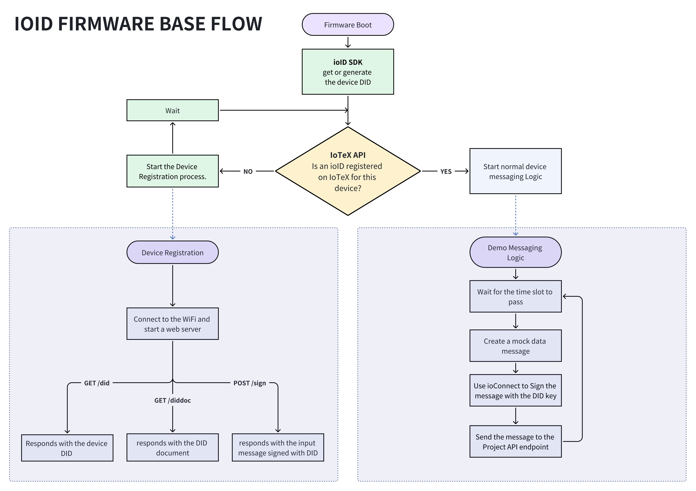

# A fully decentralized approach

This tutorial demonstrates a fully decentralized approach to managing the lifecycle of device identity and ownership in DePINs using ioID. This method aligns perfectly with the principles of a true Web3 project, enabling device owners to independently initiate and complete the registration process without relying on centralized cloud services.

The document offers a practical, hands-on guide featuring an ESP32 board, with instructions that can be easily adapted to a variety of other “machines,” including Linux-based boards, smartphones, and desktop computers.


[-> Source code on GitHub.](https://github.com/iotexproject/depin-tutorials/tree/main/esp32-device-registration)


## 1. Initial DePIN Project Setup

Ensure you have completed the steps in the [prerequisites section](./) to fund an IoTeX developer account.

### 2. Device NFT Contract

Ensure you deployed an ERC721 NFT contract to "tokenize" your devices


See how to deploy an NFT Token on IoTeX using Hardhat: [deploy-an-nft-token.md](../../defi/deploy-tokens/deploy-an-nft-token.md "mention")


**and note the deployed contract address.**

For a quicker option, you can deploy a standard NFT contract using its bytecode with the following ioctl command:

```bash
ioctl contract deploy bytecode $(curl -s https://gist.githubusercontent.com/simonerom/fd7427cd821408a5e49f4c4e81b16fb9/raw/device-nft-bytecode.hex)
```

Check the transaction link to find the address of the contract just deployed.

We will refer to this contract as the "_Device NFT_" from now on. Let's also export the contract address for convenience:

```bash
export DEVICE_NFT=0x...
```

### Register your project on IoTeX

```bash
ioctl ioid register "MY_COOL_DEPIN_PROJECT_NAME"
```

Take note of your `Project ID` and set it as an environment variable:

```bash
export PROJECT_ID=YOUR_PROJECT_ID
```

Bind the Device NFT to your Project ID

```
ioctl ioid device $DEVICE_NFT -p $PROJECT_ID
```

## Integrate ioID SDK in your device

In this step, we will use the popular ESP32 board as our DePIN device and create a simple firmware that enables the device to be registered on-chain by the device owner. This demonstrates the integration of ioID-SDK with minimal setup, making it a practical and efficient way to securely connect your DePIN devices to your Dapp on the IoTeX blockchain.


Below is a flowchart illustrating the basic flow common to most use cases. The process ensures proper device registration at boot and, during normal operation, the device utilizes its DID key to sign messages securely.


<figure><figcaption></figcaption></figure>

### Prerequisite

Before proceeding, ensure you have an [ESP32 toolchain correctly configured](https://docs.espressif.com/projects/esp-idf/en/stable/esp32/get-started/index.html) on your system. This is essential for building the code and deploying it to your ESP32 board. A [VS Code extension](https://github.com/espressif/vscode-esp-idf-extension/tree/master) is also available.

### Get the ioID-SDK example

Clone ioID-SDK and enter the ESP32 examples folder:

```bash
git clone https://github.com/iotexproject/ioID-SDK && cd ioID-SDK/example
```

Clone the tutorial:

```
git clone https://github.com/iotexproject/depin-tutorials && cd depin-tutorials
```

### Build the demo

```bash
# make sure your ESP-IDF is configured 
. $HOME/esp/esp-idf/export.sh
# Set the target chip according to your board
idf.py set-target esp32
# Clean
idf.py fullclean
# Configure SSID & Password in [Example Configuration]
idf.py menuconfig
# Build
idf.py build
# Connect your board and flash (replace the correct serial port)
idf.py -p /dev/tty.usbserial-110 flash monitor
```

### Testing the Firmware

In this demo, the firmware is designed to accept HTTPS connections from a client and respond to a request to sign an ioID registration message that the client will utilize to call the ioID registration contract (ref. [ioID Registry Contract](https://github.com/iotexproject/ioID-contracts/blob/25841427d2ed8506c577fa02858e75047a6ab840/contracts/ioIDRegistry.sol#L108)).&#x20;


In other scenarios, the device might communicate via Bluetooth or simply request the owner’s address to perform on-chain registration directly.


To test the device:

**1. Find the Device’s IP Address:**

Check the terminal output to find the IP address assigned to the device.

**2. Open a Browser:**

Use a Chrome-based browser and navigate to the following URL:

```
https://YOUR_DEVCE_IP:8000/did
```

Replace YOUR\_DEVICE\_IP with the actual IP address of the device.&#x20;

**3. Handle Security Warning:**

Accept the browser’s security warning. (The demo firmware does not provide a valid HTTPS certificate; however, in a production environment, you should use a valid certificate.)

**4. Verify the Response:**

The firmware should return some DID (Decentralized Identifier) information in response to the request:

<figure><figcaption></figcaption></figure>

The device is now ready to be registered. While any DePIN project can provide their own client to perform the actual registration, here are some tools that work with the current communication protocol implemented in this demo:

1. **The IoTeX Hub Portal:** https://hub.iotex.io/my-devices - Please notice that this is being developed at this moment.
2. **An example command line tool community-developed using NodeJS**: [https://github.com/simonerom/ioid-registration-js](https://github.com/simonerom/ioid-registration-js)

### A closer look at the code



```c
void app_main(void)
{
...
    // Generate or retrieve the DID
    did_generate();
    const char *stored_did = did_get();
    // Extract the device address from the DID
    const char *device_address = stored_did + 7; // Skip "did:io:"
    // Check if this device is already registered
    bool registered = is_device_registered(device_address);    
    if (!registered) {
        ESP_LOGI(TAG, "Device not registered. Starting registration process...");
        did_register_start();
        // Halt the program until the user reboots the device
        while (1) { vTaskDelay(pdMS_TO_TICKS(1000)); }
    } else {
        // Normal device behavior here
        ESP_LOGI(TAG, "Device already registered.");
        // Perform some work
        // Generate a data message
        // Sign it with the ioID SDK
        // Send the message to the DEPIN project's data endpoint
    }
```

